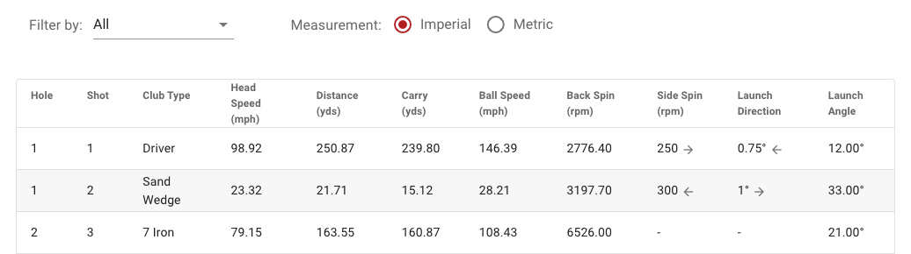

# E6Golf Frontend Developer Exercise

## Introduction

The purpose of this exercise is for the developer to exhibit familiarity with frontend technologies, programming patterns and to provide a sample of what clean and reusable code means to the candidate.

Please add any comments about your decisions you have made inline, and give a summary about the architectural choices the you made and/or considered.

## Constraints

* You can use either ES5 or ES6
* It is ok to use dependency management tools and task runners. The project has been set up to run Vue CLI tools out of the box.
* Please make sure the delivered result contains a human readable version of the source code.
* Please create a new readme or other document that explains what you have done.

*****Note: While the project has been set up using Vue CLI tooling, you are more than welcome to change any of this out to use the framework of your choice (React, Svelte, VanillaJS etc.). You are not required to use the VueJS 2 framework. i.e. you can rip that out completely if you choose, you can convert it to typescript, you can upgrade to Vue 3. Anything goes for that.***

## Exercise

You will use a sample of data representing a 9 hole round of golf played within our E6 Connect software. This includes an array of all of the shots taken in the round (`shotsNine.json`) along with data related to the player (`playerData.json`) and the round (`roundData.json`). This JSON data can be found in `src > api > data`.

Your goals for this exercise are:

1. Consume the data from the `shotsNine.json` file into your project, simulating a fake api call, and display information about each shot in the UI in however form you think is best to present this to the end user. The project is already set up to use the Vuetify 2 UI framework. The project is also already set up to use Vuex as the state management and process to make any api calls.
   * There is a lot of data associated with each shot and not all of it is necessary to be displayed. What you choose to display is at your discretion.
   * Key data fields on a shot are:
     * courseHoleIndex
     * shotIndex
     * clubTypeKey
     * totalDistance
     * carryDistance
     * launchBallSpeed
     * launchBackSpin
     * launchAngle
1. You should be able to filter the shots by club type in some form. This could be using a button, toggle, dropdown, or however you see it working best.
2. Clicking on a single shot record should display additional details about the shot. This can either be displayed on a new page, in a modal popup, or some other method of your choice. The additional data you display is also your choice.
3. Make it as visually appealing as you would like. Ultimate goal is for the data to be displayed in a user-friendly manner and function as requested.
4. Feel free to add any additional features you think would be good to have.

An example display is something like the following:



This project has been set up with all of the necessary tooling and will run without errors using:

```bash
npm start
```

## Extra Points

Adding any extra visuals or charts. Fancy UI features. Anything above and beyond is alwasy nice to see.

## Backend

There is no backend required. The sample is setup as if you were fetching data from a backend to simulate a more realistic environment

## Getting Up and Running - Build Setup

1. Clone manually into the desired location:

```bash
git clone https://github.com/trugolf/frontend_interview_exercise.git
```

2. cd into the `excercise` directory
```bash
cd exercise
```

3. Install NPM dependencies

```bash
# install dependencies
npm install
```

4. The repo does not contain eslint or prettier for code formatting.

5. Run the web app in development mode

```bash
# serve with hot reload at localhost:8080
npm start
```

6. Build the web app if desired

```bash
# build for production with minification
npm run build
```
